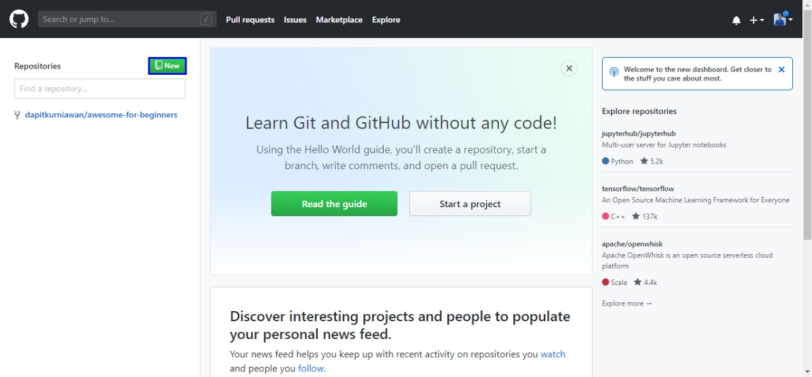

# TUGAS-PROGRAM
## Belajar tag HTML

### membuat Paragraf
berikut langkah-langkah penggunaan Git'
'
Cara install Git di windows
cara install git di windows terdiri dari 10 langkah. Berikut penjelasanya:

1. Download file git
    Untuk menginstal git, anda perlu mengunduh filenya terlebih dahulu di situs resminya. Download sesuai tipe sistem oprasi pada komputer anda,apa bila tipe sistem oprasi komputer anda 64 bit, pilih git yang mendukung windows 64bit. Tujuanya adalah agar tidak terjadi eror saat peroses istalasi git.

2. Install git
    Setelah selesai mengunduh file git, buka setup aplikasi git untuk memulai peroses instalasi. Halaman awal setelah anda membuka setup aplikasi git adalah tampilan dokumen license dari git. Klik next umtuk melanjutkan istalasi.'
'

3. Tentukan Lokasi Instalasi Git
    Selanjunya pilih lokasi untuk install git pada komputer anda. Pada tutorial ini kami mengistal dilokasi C;\Progaram File\Git. Setelah menentukan lokasi intal git, klik next untuk melanjutkan.'
'

4. Pilih komponen tambahan
    Kemudian pilih komponen tambahan untuk instal git, fungsi komponen ini adalah untuk mempelancar penggunaan git dan mendukung file dengan kapasitas besar. Sesuaikan komponen tambahan yang di pilih seperti pada gambar di bawah ini, jika sudah klik next untuk melanjutkan isntalasi.'
'

5. Tentukan nama aplikasi git
    Sebenarnya anda bebas mengganti nama aplikasi git yang akan di tampilkan pada aplikasi menu. akan tetapi demi kemudahan saat mencari aplikasi ini, sebainya menggunakan nama git saja.'
'

6. Tentukan file editor
    Untuk mengedit script melalui git anda memerlukan file editor. Anda bebas menggunakan file editor apapun untuk di kombinasikan dengan git. Pada tutorial ini, kami menggunakan vim  editor klik next apabila anda sudah menentukan file editor yang akan anda gunakan.'
'

7.  Kalian bisa next saja sampai menemukan klik instal dan pilih enemble lalu tunggu sampai insalasi selesai.'
'

Login Github 
    Langkah-langkah kedua dalam belajar menggunakan git adalah anda harus login kedalam website. Github dan git memiliki hubungan khusus, yaitu git yang berperan sebagan version control system dan github menjadi kosting atau sebagai menyimpan kode permograman. Selelah anda login akan muncul, tampilan dashboard dari github seperti gambar di bawah ini.'
'

Buat revositori
    Setelah berhasil login ke github anda bisa mulai membuat repositoriy. Klik tombol new pada menu repositories untok membuat repository baru.'
'

Kemudian anda akan di arahkan pada halaman untuk bembuat repository baru seperti gambar dibawah ini. Anda perlu mengisi detai informasi berikut:
Nama Repository     : digunakan untuk identitas reposotory yang di buat.
Dekripsi Repository : berfungsi untuk dekripsi dari repositoy yang di buat.
Jenis repositoy     : jenis repository dibagi menjadi public dan privite. ketika anda mengatu       repository menjadi public orang lain dapat melihat repository yang anda buat. sebaliknya jika anda mengatur sebagai private, repository tersebut hanya bisa di akses oleh anda.
Setelah mengisi detail informasi di atas, Klik create repository.'
' 
